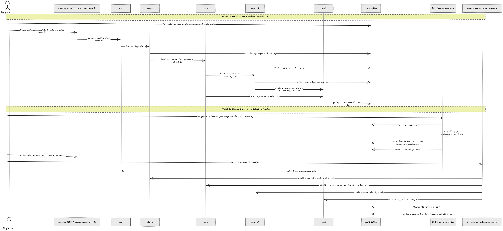

# Databricks Free Edition Selective Rebuild POC

This repository contains a reproducible Databricks Free Edition POC that shows
how to rebuild only the minimum upstream lineage branch required to regenerate a
single Gold consumer view.

Guides:

- `docs/guia_poc_databricks_free_es.md`
- `docs/guide_poc_databricks_free_en.md`
- `docs/technical_flow_reference_en.md`
- `docs/manual_execution_evidence_en.md`
- `docs/sequence_flow.png`

## Architecture Diagram

Placeholder: the final architecture diagram will be added here as
`docs/architecture_diagram.png`.

## Sequence Flow

Main implementation areas:

- `notebooks/` Databricks source notebooks
- `src/lineage_poc/` reusable Python helpers for lineage, quality, and YAML generation
- `resources/jobs/` Declarative Automation Bundle job definitions
- `databricks.yml` bundle entry point

Available bundle jobs:

- `Generate_Lineage_YAML`
- `Load_Lineage_Sales_Summary`
- `POC_End_To_End_Demo`

For a clean repeatable demo, run `notebooks/00_admin/99_reset_poc` with
`CONFIRM_RESET = RESET_POC` before launching `POC_End_To_End_Demo`.
